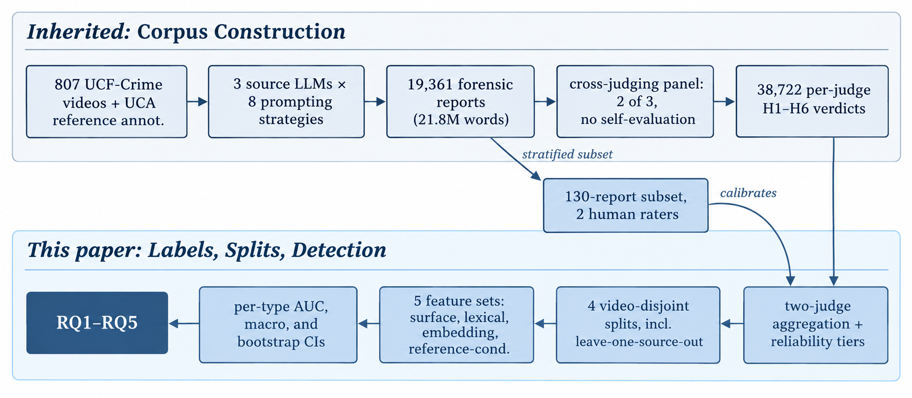
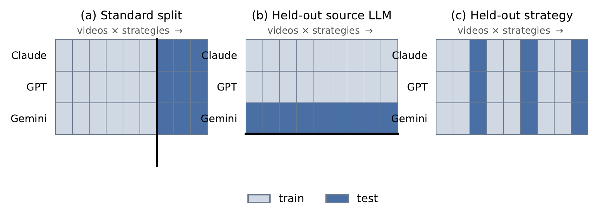
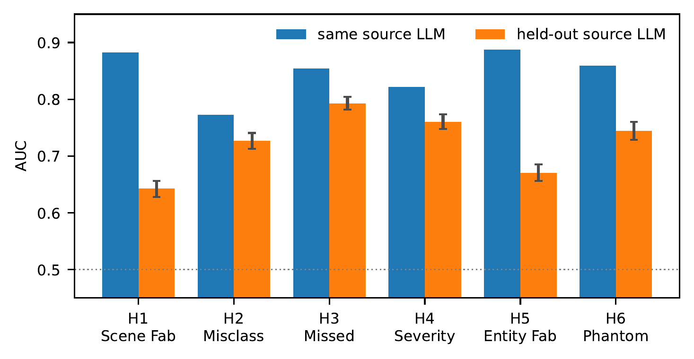

# HALT — Hallucination Across LLMs and Techniques

Anonymous artifact for a double-blind submission. Contains the benchmark, the
analysis pipeline, the results it produces, and the paper source.

**Paper:** *How Hallucination Detection Fails Across LLMs*
Across LLMs*

## What this is

Hallucination detectors are almost always evaluated on text from the same LLMs
that produced their training data. HALT makes the alternative testable: 19,361
long-form forensic reports written by three frontier multimodal LLMs under
eight prompting strategies over 807 surveillance videos, labelled for six
hallucination types by a cross-judging panel in which no model scores its own
output. Because the corpus is fully crossed, the writing model can be withheld
while the inputs stay fixed.

## Layout

```
paper/         LaTeX source, ICLR 2027 style files, compiled PDF
pipeline/      the analysis, runnable locally or in Colab
results/       every output the paper's numbers come from
figures/       figures as vector PDF, with the scripts that generate them
figures/png/   the same figures as 300 dpi PNG, for viewing here
```

## Figures



*The HALT pipeline. The shaded band is inherited; the remainder is this paper.*



*The corpus is fully crossed, so the same reports admit several disjoint
partitions. Existing hallucination benchmarks admit only (a).*



*Per-type detector AUC under the standard same-source split and under
leave-one-source-out. The fabrication types lose roughly four times as much as
omission and distortion, inverting the ordering a same-source evaluation would
report.*

## Reproducing the results

```
cd pipeline
pip install -r requirements.txt
export HALLUBENCH_RAW=/path/to/the/raw/files
./run_all.sh
```

Or open `pipeline/colab_analysis.ipynb`, which is self-contained: it locates
the data folder, stages the inputs, writes the scripts, runs everything, and
adds bootstrap intervals and figures.

Deterministic (seed 42), CPU only, roughly 20 to 30 minutes.

## Building the paper

```
cd paper && latexmk -pdf paper.tex
```

Nine pages of main text plus statements, references. `paper.tex` pulls in
`section3.tex`.

## Two things anyone using this data must know

**`full_labeled_dataset_full.csv` contradicts the published statistics.** It
aggregates the two judges with OR, giving 98.46% ANY and 3.550 per report. The
correct rule is a two-judge majority with ties broken toward no hallucination,
which with two judges is AND, giving 91.1% and 2.58. Every label in this
pipeline is rebuilt from `panel_raw_judge_labels_full.csv`; the other file is
read only for report text.

**The raw judge file contains `-1` sentinels.** Twenty-four cells across four
judge rows. These are judge failures, not verdicts, and are excluded from the
vote.

## Verification targets

`00_build_benchmark.py` warns automatically if these drift.

| Quantity | Expected |
|---|---|
| Reports / videos / judge rows | 19,361 / 807 / 38,722 |
| Self-judging rows | 0 |
| ANY hallucination | 91.13% |
| Mean per report | 2.580 |
| Macro kappa, panel vs human consensus | 0.556 |

## Findings, and where each lives

1. **Detection does not transfer across writing models.** Fabrication 0.89 to
   0.686, omission 0.85 to 0.793, binary 0.820 to 0.566, with non-overlapping
   bootstrap intervals in all three folds. → `LOGO_REPORT.md`, `logo_auc_ci.csv`
2. **Grounding is the only lever on binary detection**, 0.566 to 0.702, while
   losing to lexical features on omission. → `LOGO_REPORT.md`
3. **Panel labels track report length** where human labels do not, localised to
   two types. → `ARTIFACT_TEST.md`
4. **Excluding self-evaluation confounds writer with judge pair.** Axis-level
   signatures survive; one fine-grained ordering does not. → `JUDGE_CONFOUND.md`

`logo_strict_results.csv` repeats finding 1 with video disjointness
additionally enforced. Every number falls and the gap widens, so the reported
figures are conservative.

`results/EXTENDED_RESULTS.md` holds the tables the paper cites as the released
artifact.

## Anonymity

This repository is anonymised for double-blind review. Author names,
affiliations, and identifying paths have been removed, and the prior work the
corpus derives from is cited without authors. It will be de-anonymised after
the review period.
